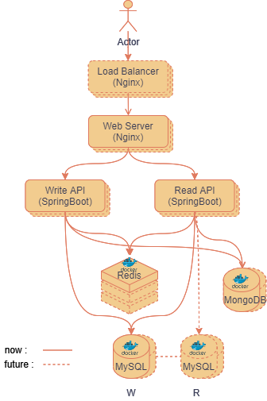

<h2 align="center">SyPastebin</h2>

A Web clipboard application developed for sharing, displaying, and storing code. 
一个为便于分享、展示和存储代码而开发的前后端分离、读写服务分离的 Web剪切板应用. 
🎉 欢迎访问 🎉 
👇👇 

<a href = "http://sustart68.cn" target="_blank">SyPastebin</a>

 
index

 

 architecture

 

## Usage

### Main

1. SpringBoot: 2.4.2
2. Maven: 3.6.3
3. MySQL: 8.0
4. MongoDB: 4.4.3
5. JDK: 1.8
6. Redis: 6.2.5

### Others

1. Log framework: Logback
2. RestApi document: Swagger2  
visit:http://localhost:8080/swagger-ui.html
3. DatabasePool: Druid  
visit: http://localhost:8080/druid/index.html
4. Editor framework: [Ace](https://ace.c9.io/)

## Achieved

- [x] 通过 Mybatis 对 MySQL 的 CRUD；
- [x] 通过 Spring Data MongoDB 对 MongoDB 的 CR；
- [x] 用户自定义短URL；
- [x] 前端优化：美观、在线源代码编辑器插件；
- [x] 获取用户 IP；
- [x] 生成短 URL 算法；
- [x] 定期删除过期 paste 服务；
- [x] 增加全局异常处理；
- [x] 集成 Druid 连接池，监控数据库操作；
- [x] 集成 Swagger API 接口文档展示；
- [x] 增加内容安全保障：使用对称加密技术 AES128 对内容加密保存、读取解密；
- [x] 使用 Redis 缓存，实现缓存预热，提高用户查询速度。

## Future

### 新功能
- [ ] 增加用户登录及其相关功能；
- [ ] 利用websocket做实时编辑功能，用户能够开辟一个在线粘贴板，得到一个url分享出去。对方可实时查看到最新编辑。
- [ ] 在粘贴板下增加一个评论系统，用户可实时在当前粘贴面板上评论、聊天。

### 前端
- [ ] 优化前端交互，人机页面更友好；
- [ ] 优化前端代码，删除无用代码；
- [ ] 研究 and 开启更多 **Ace** 插件的功能。

### 后端
- [ ] 服务跟踪：生成点击次数。
- [ ] 网站用户访问数计算：布隆过滤器，对相同用户去重。
- [ ] 从应用层面对两个数据库的操作增加事务，保证事务一致性。
- [ ] 使用Docker部署上线。
- [ ] 部署时使用Nginx反向代理，感受多服务器处理。
- [ ] 项目优化（包括服务逻辑、数据库索引、数据库逻辑、代码结构等）。
- [ ] 服务支持 https。

有些想到再加~~~🧐🧐

持续撸码维护中~~~🥳🥳

# License
[Apache license](https://www.apache.org/licenses/LICENSE-2.0)
